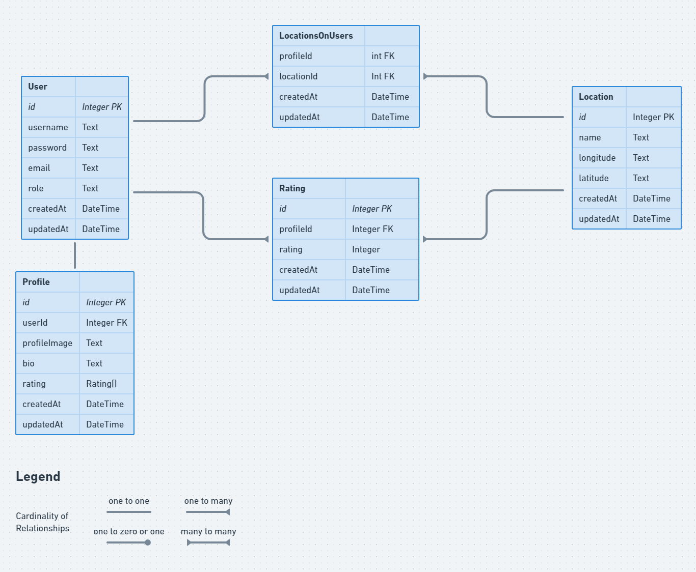

# Spontaneously Nomadic Server

## Introduction

An express server providing back-end functionality for https://github.com/bravint/spontaneously-nomadic-client.

I wanted this server to reflect everything I have learnt over the course of my 6 months at Boolean UK as well as to explore using TypeScript and third party npm packages - getting familar with reading documentation and looking for solutions to problems and bugs in GitHub issues are examples of the skills I improved upon as a result.

## Table of Contents

 - [Current Project Status](#Current-Project-Status)
 - [Upcoming Features](#Upcoming-Features)
 - [Stack Used](#Stack-Used)
 - [User Stories](#User-Stories)
 - [Database Structure](#Database-Structure)
 - [Install](#Install)

## Current Project Status

**MVP completed** : 2 week project with 3 day sprints

*see upcoming features to see where I will take this project next!*

## Upcoming Features

Add abilty to have friends / followers to the server and client**

## Stack Used:

 - **Passport.js**, **bcrypt**, **jsonwebtoken** : handles user authentication\
 - **Joi** : validate requests to the server\
 - **Prisma** : ORM to abstract SQL database requests\
 - **PostgreSQL** : database to store client data\
 - **TypeScript** : add type-checking to JavaScript

## User Stories

 - As a user i should be able to place pins/markers on a map of the world to mark places I have been to\
 - As a user I should be able to rate these places in order to track whether I like places\
 - As a user I want to be able to add places I would like to visit in the future\
 - As a user I should be able to create an account in order to save a list of places and my ratings\
 - As a user I should be able to see ratings for places that other users have visited

## Database Structure

Prisma schema was derived from the following ERD:

## Install

Install dependencies: <code>npm install</code>\
Start server: <code>npm run dev</code>

*Optional*: Compile .ts files to /dist folder: <code>npm build</code>